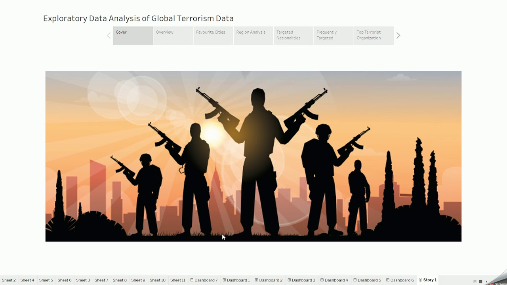

# Global-Terrorism-Data-Analysis

# Introduction 
Terrorism is a complex global issue that affects countries and communities worldwide. Analyzing terrorism data can provide valuable insights into trends, patterns, and hotspots, aiding in understanding and combating this threat. Python, with its powerful libraries for data analysis and visualization, such as pandas, matplotlib, and seaborn, offers a robust platform for conducting such analyses.
  Our analysis will focus on various aspects of terrorism, including the frequency of attacks over time, the most affected regions and countries, the types of attacks, the targets, and the perpetrators involved. Additionally, we will explore the relationship between terrorism and other socio-economic factors, such as GDP, population, and political stability.
  Through this project, we hope to gain a deeper understanding of the dynamics of global terrorism and contribute to efforts aimed at addressing this critical issue.

  

  

# This Project Includes
1. Understand The Dataset.
2. Data Loading.
3. Data reading.
4. Data Processing.
5. Univarient Analysis.
6. Multivarient Analysis.
7. Detect Outlier.
8. Data Visualization.
